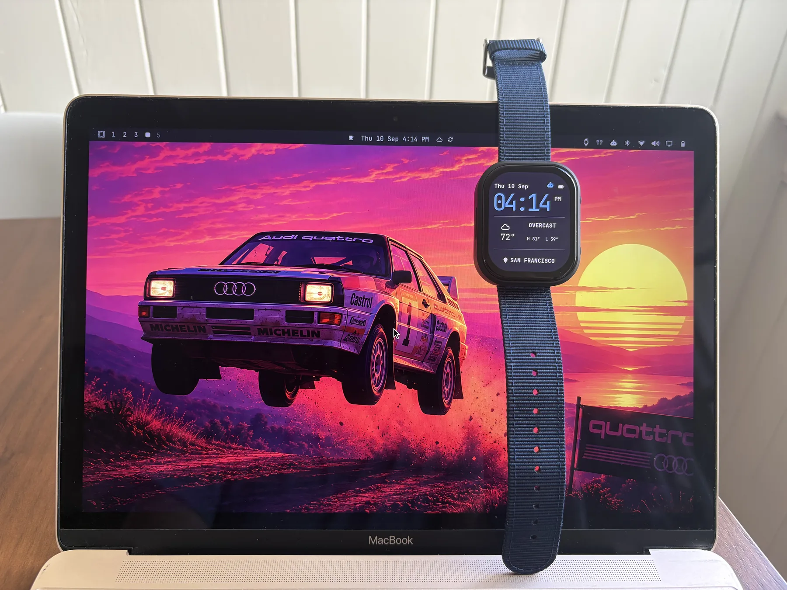
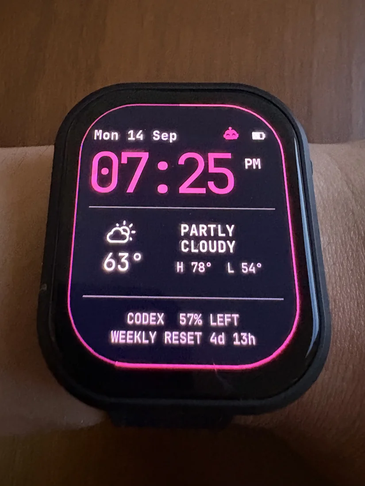

# Omarchy Watch

An Omarchy smartwatch for the [Waveshare ESP32-S3-Touch-AMOLED-2.06](https://www.waveshare.com/wiki/ESP32-S3-Touch-AMOLED-2.06), with a top-bar widget and desktop client for pairing, settings, and sync.



_This is an independent community project, not an official Omarchy project._

## Key features

<p align="center">
  
</p>

- A watch face designed to match Omarchy's look and feel with JetBrains Mono and Nerd Fonts glyphs.
- A top-bar widget for pairing, connection status, brightness, and completion sound.
- Date, time, and weather from your desktop top bar.
- Color scheme automatically synced to your current Omarchy theme.
- Agent status and task completion alerts (Codex-only at the moment).

## Install

The easiest way to get started is to ask your coding agent to follow the steps below. It can flash the watch, install the desktop client, and guide you through pairing.

Omarchy Watch requires Omarchy 4.0 or newer, Bluetooth LE, and the exact
Waveshare ESP32-S3-Touch-AMOLED-2.06 board. The board is development hardware,
not a waterproof consumer watch.

### 1. Flash the watch

Download `omarchy-watch-v0.5.2-flash.tar.gz` from the
[latest release](https://github.com/iamjamesim/omarchy-watch/releases/latest),
extract it, connect the board's USB-C programming port, and run:

```bash
./flash.sh /dev/ttyACM0
```

The release bundle requires Espressif's `esptool`. It writes the bootloader,
partition table, and application separately so firmware upgrades preserve the
watch's pairing and settings. See the [firmware guide](firmware/README.md) for
source builds, recovery, and complete flashing details.

### 2. Install the Omarchy companion

Clone the repository, then run its installer:

```bash
git clone https://github.com/iamjamesim/omarchy-watch.git
cd omarchy-watch
./desktop/install-local.sh
```

The installer adds the desktop bridge, Omarchy bar widget, and Codex lifecycle
hooks without requiring root. Open `/hooks` in Codex and trust the Omarchy
Watch entries before starting a new session.

### 3. Pair

Pair through the Omarchy Watch panel, not Omarchy's general Bluetooth panel or `bluetoothctl`. When the companion discovers an unpaired watch, its top-bar panel opens automatically and focuses the code field. Enter the six-digit code shown on the watch and select **Pair**.

If discovery takes longer than expected, open the persistent watch icon and
select **Scan Again**. Pairing is only required once.

## Update

Update the desktop companion from its checkout:

```bash
git pull --ff-only
./desktop/install-local.sh
```

Flash the three-file bundle from the newest tagged release to update the watch
without erasing its bond or settings.

## Remove

From the repository checkout:

```bash
./desktop/uninstall-local.sh
```

Removal stops the bridge and removes its commands, panel, service, and Codex
hook entries. Pairing identity, settings, and cached state are deliberately
preserved so a reinstall can reconnect. The identity is also the watch's owner
credential: deleting only the desktop copy would require a watch factory reset
before it could be paired again. For coordinated removal of both sides, see
the [desktop guide](desktop/README.md#complete-reset-or-removal).

## Agent status and alerts

An Omarchy robot appears while Codex is working. When a turn finishes, the
watch wakes, plays a chime, and gently bounces the robot. The robot remains
until you acknowledge it with a tap. Designed to let you step away and make a
cup of coffee instead of watching the terminal.

The integration uses Codex lifecycle hooks but never reads your prompts,
responses, or transcripts.

## Troubleshooting

Bluetooth behavior can vary across Linux hardware and drivers. If something does not work, check the [desktop troubleshooting guide](desktop/README.md#troubleshooting) and [open an issue](https://github.com/iamjamesim/omarchy-watch/issues) with your Omarchy version, Bluetooth adapter, and relevant logs. Fixes and PRs are welcome.

## More details

- [Firmware](firmware/README.md) — build, flash, power, and boot behavior
- [Desktop companion](desktop/README.md) — requirements, settings, and diagnostics
- [Design](docs/design.md) — watch-face and product decisions
- [Connectivity](docs/connectivity.md) — secure pairing and Bluetooth protocol
- [Simulator](simulator/README.md) — deterministic watch-face previews

## License

Project code and design assets are available under the [MIT License](LICENSE).
Generated fonts retain their upstream terms; see
[third-party notices](THIRD_PARTY_NOTICES.md).
