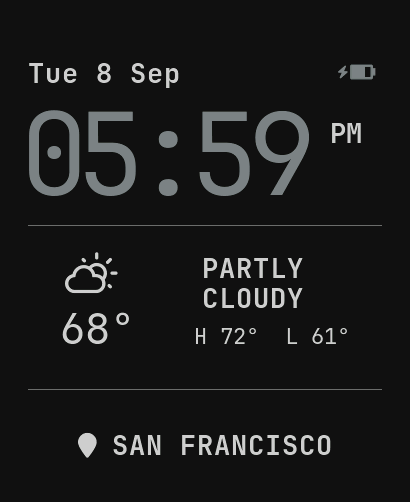

# Omarchy Watch

An Omarchy companion for the Waveshare ESP32-S3-Touch-AMOLED-2.06. The first
checkpoint is intentionally small: a polished watch face, secure Bluetooth
pairing, and a dependable Omarchy-synchronized face that survives normal
restarts.

This is an independent community project, not an official Omarchy project.



## v0.3 checkpoint

- Plain 01 watch face at the display's native 410 x 502 resolution
- compact date/battery header, dominant clock, live weather, and
  location footer in JetBrains Mono
- live AXP2101 battery level and charging state
- accent-colored battery status with tap-to-reveal exact percentage
- deterministic desktop previews rendered by the same LVGL layout as firmware
- authenticated Bluetooth LE pairing using the six-digit code on the watch
- persistent watch and desktop identities; pairing is a one-time setup
- automatic time, UTC offset, and 12/24-hour synchronization from Omarchy
- automatic background, foreground, and accent synchronization from the
  resolved Omarchy theme; the face matches the desktop bar surface while its
  clock carries the theme's primary highlight
- current conditions, daily high/low, units, and location from Omarchy's
  canonical weather setting, refreshed every 15 minutes and cached offline
- board RTC restore at boot, with an honest unsynchronized state if its time
  cannot be trusted
- Omarchy bar panel for discovery, pairing, connection status, brightness, and
  manual sync
- 50% default active brightness, a 15-second touch-wake display timeout, CPU
  frequency scaling, automatic light sleep, and Bluetooth modem sleep
- five-second, low-battery-aware previews for prompt theme and brightness
  changes; periodic weather and time updates stay dark

The simulator keeps a deterministic San Francisco/Solitude fixture for pixel
comparisons; firmware receives live values in the version 3 effective profile.

## Product boundary

The watch inherits useful context from Omarchy without mirroring the desktop
UI. The desktop resolves defaults and future overrides into a complete,
versioned profile; the firmware stores that effective profile and stays useful
when the computer is away.

An owned watch has three truthful boot outcomes:

1. A valid RTC and cached profile render the face immediately.
2. A lost or invalid RTC shows `TIME NOT SET` while the existing Bluetooth bond
   reconnects and repairs it automatically.
3. A watch with no owner shows its pairing code.

See [the design notes](docs/design.md) and
[connectivity contract](docs/connectivity.md) for the decisions and evolution
constraints behind this split.

## Repository

- `firmware/` — ESP-IDF firmware for the Waveshare board
- `desktop/` — BlueZ bridge, command-line client, and Omarchy shell plugin
- `simulator/` — native LVGL renderer for exact, deterministic face previews
- `prototype/` — early browser sketches retained as design history
- `docs/` — product, UI, pairing, and protocol decisions
- `tools/` — preview and font-generation commands

Build and installation details live in `firmware/README.md` and
`desktop/README.md`.

## Render the watch face

The face layout is shared by the firmware and a small host renderer. After
ESP-IDF has downloaded the managed LVGL dependency, render the exact RGB565
layout without connecting a watch:

```bash
cd firmware
. /path/to/esp-idf/export.sh
idf.py reconfigure
cd ..
./tools/render-watchface.sh
```

The command writes square and rounded PNGs under `simulator/output/`. See the
[simulator guide](simulator/README.md) for host dependencies and the boundary
between deterministic previews and physical-display validation.

## Direction after v0.3

The next coherent slice is companion behavior: notifications, media controls,
and explicit follow-or-override settings. Additional faces and seasonal
timezone rules can build on the same effective-profile foundation.

Longer-term possibilities include a deeper Omarchy companion, agent-generated
watch software, daily-watch fundamentals, and ports to hardware such as
Pebble. The first version remains a focused prototype, not a smartwatch OS.

## License

Project code and design assets are available under the [MIT License](LICENSE).
Generated LVGL font subsets retain their upstream terms; see
[third-party notices](THIRD_PARTY_NOTICES.md) and the included
[SIL Open Font License 1.1](firmware/main/fonts-OFL.txt).
